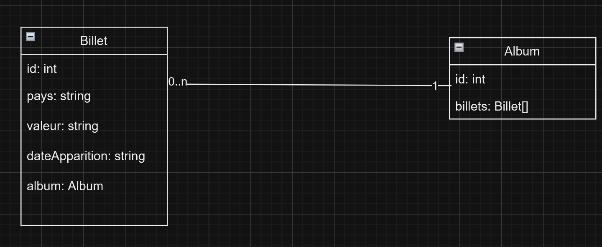

Le but de ce projet est de développer une application pour gérer une collection de billets d'argent provenant de différentes régions du monde. 

L'objectif est de créer une plateforme qui permet de stocker, organiser et afficher les billets en fonction de leur pays d'origine, de leur valeur, et leur date d'apparition.

Veuillez-trouver ci-dessous le tableau de correspendance vous permettant d'établir le lien entre les abstractions [Inventaire], [Galerie] et [Objet] dans l'énoncé du TP ainsi que les entités du projet.

| [Objet]      | Billet d'argent |
|--------------|-----------------|
| [Inventaire] | Album           |
| [Galerie]    | Exposition      |

Pour plus de clarifications, vous trouverez ci-dessous le diagramme de classe de mon application:

