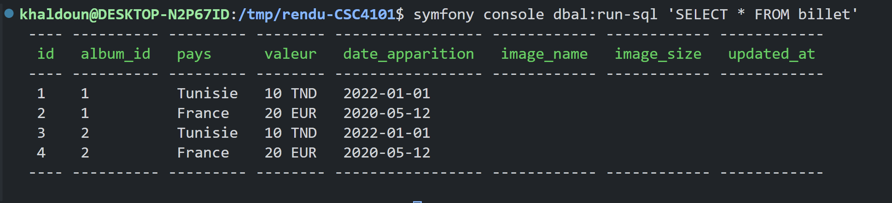

Le but de ce projet est de développer une application pour gérer une collection de billets d'argent provenant de différentes régions du monde. L'objectif est de créer une plateforme qui permet de stocker, organiser et afficher les billets en fonction de leur pays d'origine, de leur valeur, et leur date d'apparition.

| [Objet]      | Billet d'argent |
|--------------|-----------------|
| [Inventaire] | Album           |
| [Galerie]    | Exposition      |

