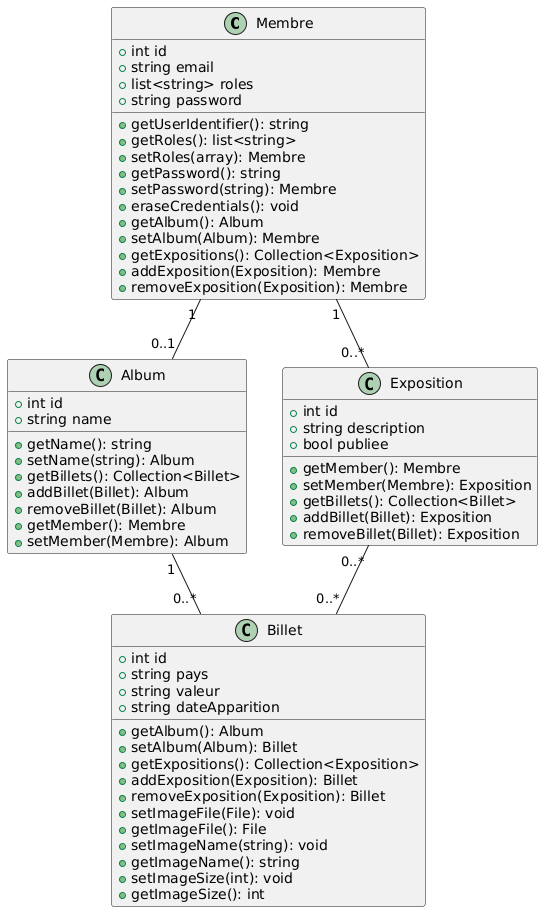

Le but de ce projet est de développer une application pour gérer une collection de billets d'argent provenant de différentes régions du monde. 

L'objectif est de créer une plateforme qui permet de stocker, organiser et afficher les billets en fonction de leur pays d'origine, de leur valeur, et leur date d'apparition.

Veuillez-trouver ci-dessous le tableau de correspendance vous permettant d'établir le lien entre les abstractions [Inventaire], [Galerie] et [Objet] dans l'énoncé du TP ainsi que les entités du projet.

| [Objet]      | Billet d'argent |
|--------------|-----------------|
| [Inventaire] | Album           |
| [Galerie]    | Exposition      |

Pour plus de clarifications, vous trouverez ci-dessous le diagramme de classe de mon application:

A priori, tout ce qui a été demandé fonctionne normalement.

Des datafixtures sont  à votre disposition pour charger les données via la commande symfony console doctrine:fixtures:load -n (après avoir créé la base de donnée et le schema bien sur)

Les utilisateurs disponibles sont:
-   olivier@localhost  avec un accés USER ordinaire
-   slash@localhost  avec un accés ADMIN.
Le mot de passe est 123456 pour les deux utilisateurs.

Les routes:
- /billet et /album permettant de voir tous les billets et albums sont accessibles seulement après login. 
- /exposition reste accessible sans login mais seulement pour voir les expositions publiques.
- /member permet de voir la liste des membres sans voir leurs détails sans login.

Comme instruit dans l'énoncé du projet, pour créer une nouvelle exposition: il faut se rendre sur la page mentionnant les détails (expositions) d'un membre sur /member/{id} afin de pouvoir créer une nouvelle exposition.

Afin de créer un nouveau billet, if vous suffit de vous rendre au détails de l'album de l'utilisateur concerné aussi. 

Bien sur, les opérations CRUD ne sont disponibles que pour l'utilisateur possédant la ressource et pour les admins.

L'upload d'images est aussi faisable lors de la création d'un nouveau billet.

Pour toute information complémentaire, je reste joignable sur khaldoun.taktak@telecom-sudparis.eu